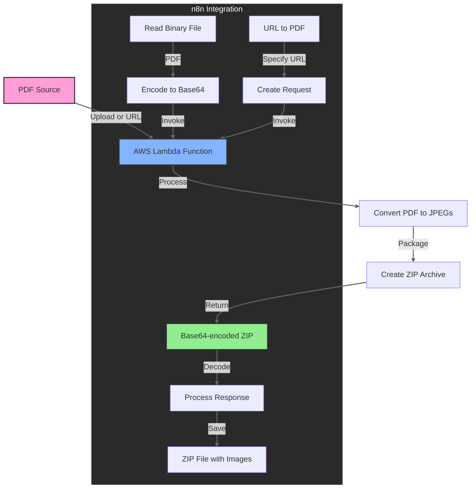

# Lambda PDF Converter

[](https://youtu.be/1siwCee9lpw "Watch the Tutorial")

Transform PDF files into high-quality JPEG images with this AWS Lambda function. Designed for seamless integration with automation tools like n8n, this solution delivers converted images as a convenient ZIP archive at a fraction of the cost of commercial API services.

## ✨ Features

- Converts PDF files to JPEG images with adjustable quality
- Accepts either direct PDF uploads or URLs to PDF files
- Returns all images as a single ZIP file
- Handles multi-page PDFs efficiently
- Proper error handling and logging
- Docker-based deployment for simplicity and consistency

## 🎯 Why Use This?

- **Ultra Cost-Effective**: ~$0.42/month for 10,000 conversions vs $100-1,000 with SaaS APIs
- **Complete Control**: Customize conversion parameters exactly to your needs
- **Serverless Architecture**: No servers to manage, maintain, or monitor
- **Seamless Integration**: Works with n8n, websites, apps, or any system that can make HTTP requests
- **Scale Automatically**: Handles thousands of simultaneous conversions without configuration
- **Privacy Focused**: Your documents never leave your AWS account
- **Deployment Flexibility**: Choose between Docker-based approach or Lambda Layers

## 💰 Cost Breakdown

- **AWS Lambda Costs**:
  - Free Tier: 1 million free requests + 400,000 GB-seconds/month
  - Beyond Free Tier: $0.20 per million requests + $0.0000166667 per GB-second
  
- **Real-World Example** (10,000 PDFs/month with 512MB Lambda):
  - Request cost: 10,000 × $0.20/million = $0.002
  - Compute cost: 10,000 × 5 seconds × 0.5GB × $0.0000166667/GB-second = $0.42
  - **Total: $0.42 per month**

- **Compared to Commercial Services**:
  - SaaS PDF conversion APIs: $10-100/month for similar volume
  - Pay-per-conversion APIs: $0.01-0.10 per conversion ($100-1,000 for 10,000 files)
  - Many services impose rate limits or queue processing at lower tiers

## 🏗️ Architecture

### System Flow



### AWS Services

- **AWS Lambda**: 
  - Runs containerized PDF conversion function
  - Scales automatically with demand
  - Pay-per-use pricing model

- **Amazon ECR**: 
  - Stores Docker container image
  - Manages container versions
  - Integrates with Lambda service

- **IAM**: 
  - Secure execution role for Lambda
  - Least-privilege permission model
  - Integration with external services

## 🔄 AWS Lambda for Non-AWS Users

If you've used automation tools like n8n but aren't familiar with AWS Lambda, here's what you need to know:

### What is AWS Lambda?

AWS Lambda is a "serverless" computing service that lets you run code without managing servers. Think of it like a specialized function in n8n, but instead of running within the n8n workflow, it runs in the cloud (AWS).

**In simple terms:**
- You upload your code (like our PDF converter function)
- AWS runs that code when it's triggered (by an API call, a file upload, etc.)
- You only pay for the computing time you actually use

**Compared to SaaS API services:**
- With commercial PDF conversion APIs, you pay for a subscription or per-conversion fee
- With Lambda + n8n, you run your own conversion service in AWS at a fraction of the cost
- You maintain control over the process while still keeping it serverless and scalable
- You can customize the conversion parameters exactly to your needs

### Docker-based Lambda Functions (Our Approach)

This project uses a Docker-based approach for AWS Lambda, which offers several advantages:

**What is a Docker-based Lambda?**
- Instead of uploading code files directly, we package our function in a Docker container
- This container includes all necessary dependencies, including poppler for PDF conversion
- AWS runs this container when the Lambda function is invoked

**Advantages of the Docker approach:**
- **Simplified Dependencies**: No need to create separate Lambda Layers - everything is in one container
- **Consistent Environment**: The exact same environment runs locally and in AWS
- **Easier Debugging**: You can test the container locally before deploying
- **No Library Path Issues**: Avoids common problems with shared libraries often encountered with Lambda Layers
- **Larger Size Limit**: Docker images can be up to 10GB, compared to 250MB for regular Lambda deployments

**How it works:**
1. We create a Dockerfile that includes Python, poppler utilities, and our code
2. The build script builds this Docker image and pushes it to Amazon ECR (container registry)
3. Our Lambda function runs this container image when invoked

## 🚀 Getting Started

### Prerequisites

- AWS Account
- AWS CLI configured
- Docker installed and running
- Python 3.12+ installed
- Basic knowledge of AWS Lambda
- n8n workflow automation tool (optional)

### Quick Deployment

For a fully automated deployment to AWS Lambda, use the provided deployment script:

```bash
# Make the deployment script executable
chmod +x build_and_deploy.sh

# Run the deployment script
./build_and_deploy.sh
```

This script will:
1. Check if a Lambda execution role exists and create one if needed
2. Create an ECR repository for the Docker image if it doesn't exist
3. Build and tag the Docker image with all dependencies included
4. Push the Docker image to Amazon ECR
5. Create or update the Lambda function to use this Docker image
6. Configure proper memory, timeout, and other settings

By default, it creates a Lambda function named `pdf-to-jpg-converter` in the `us-east-1` region. You can edit the script variables to customize these settings.

### Testing Locally

You can test the Docker container locally before deploying:

```bash
# Build the Docker image
docker build -t pdf-converter .

# Run the container with a test PDF
docker run -p 9000:8080 pdf-converter
```

In another terminal:
```bash
# Invoke the local function with a test event
curl -XPOST "http://localhost:9000/2015-03-31/functions/function/invocations" -d '{"pdf_url":"https://example.com/document.pdf"}'
```

## 🔌 Integrating with n8n

### Setting Up Least Privilege AWS Credentials

For security best practices, create an IAM user with only the minimum permissions needed:

1. **Create a new IAM Policy:**
   - Go to AWS IAM Console → Policies → Create Policy
   - Choose JSON and paste the following:
   ```json
   {
       "Version": "2012-10-17",
       "Statement": [
           {
               "Effect": "Allow",
               "Action": "lambda:InvokeFunction",
               "Resource": "arn:aws:lambda:*:*:function:pdf-to-jpg-converter"
           }
       ]
   }
   ```
   - Replace `pdf-to-jpg-converter` with your function name
   - Name the policy something like `n8n-pdf-converter-policy`

2. **Create a new IAM User:**
   - Go to AWS IAM Console → Users → Add User
   - Enter a name like `n8n-pdf-converter`
   - Select "Access key - Programmatic access"
   - Click "Next: Permissions"
   - Choose "Attach existing policies directly"
   - Search for and select your `n8n-pdf-converter-policy`
   - Complete user creation and save the access key ID and secret

3. **Use these credentials in n8n:**
   - When setting up your AWS credentials in n8n, use these limited access keys
   - This restricts n8n to only invoke this specific Lambda function
   - No other AWS resources or actions will be available to n8n

### Setting Up in n8n

1. In your n8n workflow, add an **AWS Lambda** node
2. Configure AWS credentials in n8n:
   - Access Key ID (from limited IAM user)
   - Secret Access Key (from limited IAM user)
   - Region (must match your Lambda function's region)
3. In the Lambda node configuration:
   - Function Name: `pdf-to-jpg-converter` (or your chosen name)
   - Invocation Type: `RequestResponse`

### Converting a PDF File Using n8n

#### Option 1: Using a local PDF file

1. Use a **Read Binary File** node to read your PDF file
2. Connect it to a **Function** node to encode the file to base64:
   ```javascript
   return {
     json: {
       body: $binary.data.toString('base64')
     }
   };
   ```
3. Connect to your configured **AWS Lambda** node

#### Option 2: Using a PDF URL

1. Use a **Function** node to specify a PDF URL:
   ```javascript
   return {
     json: {
       body: JSON.stringify({
         pdf_url: "https://example.com/path/to/document.pdf"
       })
     }
   };
   ```
2. Connect to your configured **AWS Lambda** node

### Processing the Response in n8n

1. The Lambda will return a base64-encoded ZIP file containing JPEG images
2. Use a **Function** node to decode the response:
   ```javascript
   const zipContent = Buffer.from($node["AWS Lambda"].json.body, 'base64');
   return {
     json: { success: true },
     binary: {
       data: {
         data: zipContent,
         mimeType: 'application/zip',
         fileName: 'pdf_images.zip'
       }
     }
   };
   ```
3. Connect to a **Write Binary File** node to save the ZIP file

## 🧩 Alternative Approach: Lambda Layers

While this project uses a Docker-based approach, another common method is to use Lambda Layers. Here's a brief overview:

### What are Lambda Layers?

Lambda Layers are a way to package code and dependencies that can be shared across multiple Lambda functions.

**In simple terms:**
- Layers are packages of libraries or runtime components
- They get "attached" to your Lambda function when it runs
- They save you from having to include common dependencies in every function

**Layer Structure for Python:**
```
layer.zip
│
└── python/
    └── lib/
        └── python3.12/
            └── site-packages/
                └── [your packages and modules]
```

**For binary dependencies (like poppler):**
```
layer.zip
│
└── bin/               # Executable files
└── lib/               # Shared libraries
└── include/           # Header files
```

You can learn more about this approach in AWS documentation if needed.

## 📄 License

MIT